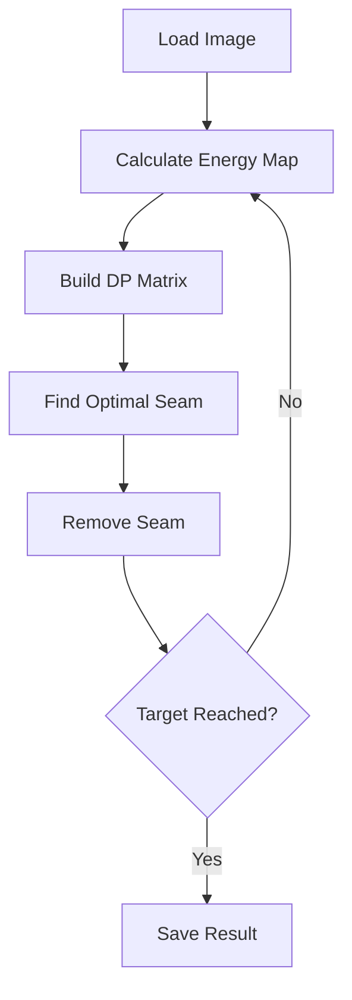

# Seam Carving Algorithm

[](https://opencv.org/)
[](https://en.cppreference.com/)
[](LICENSE)

> **Repository:** [https://github.com/Anurag-1205/Seam-Carving-Algorithm.git](https://github.com/Anurag-1205/Seam-Carving-Algorithm.git)

A high-performance implementation of the **Seam Carving Algorithm** for content-aware image resizing using C++ and OpenCV. This algorithm intelligently removes pixels along low-energy seams to resize images while preserving important visual content.

## 🚀 Features

- **Content-Aware Resizing**: Preserves important image features while removing less significant pixels
- **Real-time Visualization**: Interactive display showing seam removal process
- **Bidirectional Resizing**: Supports both width and height reduction
- **High Performance**: Optimized C++ implementation with efficient memory management
- **Cross-platform**: Compatible with Linux, Windows, and macOS
- **OpenCV Integration**: Leverages OpenCV for robust image processing

## 📋 Table of Contents

- [Algorithm Overview](#algorithm-overview)
- [Installation](#installation)
- [Usage](#usage)
- [Technical Implementation](#technical-implementation)
- [Performance Analysis](#performance-analysis)
- [Examples](#examples)
- [Contributing](#contributing)

## 🔬 Algorithm Overview

Seam carving is a content-aware image resizing technique that removes pixels along connected paths (seams) of low energy, preserving the most important visual information.

### Core Algorithm Steps

1. **Energy Calculation**: Compute pixel energy using gradient magnitude
2. **Dynamic Programming**: Find minimum energy seam using bottom-up DP
3. **Seam Detection**: Trace optimal seam path from top to bottom
4. **Seam Removal**: Remove seam pixels and reconstruct image
5. **Iteration**: Repeat until target dimensions are reached

### Energy Function

The algorithm uses a dual-gradient energy function:

```
E(i,j) = |∂I/∂x| + |∂I/∂y|
```

Where gradients are computed using RGB channel differences with neighboring pixels.

## 🛠 Installation

### Prerequisites

- **C++ Compiler** (GCC 7+ or Clang 5+)
- **OpenCV 4.x** libraries
- **CMake** (optional, for advanced builds)

### Ubuntu/Debian

```bash
sudo apt update
sudo apt install libopencv-dev pkg-config
```

### macOS

```bash
brew install opencv pkg-config
```

### Windows

Download OpenCV from [opencv.org](https://opencv.org/releases/) and configure your build environment.

## 🚀 Usage

### Compilation

```bash
g++ main.cpp `pkg-config --cflags --libs opencv4` -o seam_carving
```

**Alternative compilation (if pkg-config issues):**
```bash
g++ main.cpp -I/usr/include/opencv4 -lopencv_core -lopencv_imgproc -lopencv_imgcodecs -lopencv_highgui -o seam_carving
```

### Execution

```bash
./seam_carving <input_image_path>
```

**Example:**
```bash
./seam_carving sample_image.jpg
```

### Interactive Mode

The program will prompt you for:
- **Desired Height**: Target height in pixels
- **Desired Width**: Target width in pixels

> ⚠️ **Note**: Target dimensions must be smaller than the original image dimensions.

### Output

- **Real-time Animation**: Window showing seam removal process
- **Final Result**: Resized image displayed and saved as `output_resized.png`

## 🔧 Technical Implementation

### Data Structures

- **OpenCV Mat**: Primary image storage and manipulation
- **Dynamic Arrays**: Custom 2D arrays for energy and DP matrices
- **Memory Management**: Manual allocation/deallocation for optimal performance

### Key Functions

| Function | Purpose | Complexity |
|----------|---------|------------|
| `cal_energy()` | Compute pixel energy values | O(H×W) |
| `cal_dp()` | Build dynamic programming matrix | O(H×W) |
| `find_seam()` | Trace optimal seam path | O(H×W) |
| `remove_seam()` | Remove seam and reconstruct image | O(H×W) |

### Algorithm Flow



## 📊 Performance Analysis

### Time Complexity

- **Single Seam Removal**: O(H×W)
- **k Seam Removals**: O(k×H×W)
- **Overall**: Linear in number of pixels removed

### Space Complexity

- **Energy Matrix**: O(H×W)
- **DP Matrix**: O(H×W)
- **Total**: O(H×W)

### Optimization Features

- **Efficient Memory Management**: Custom matrix allocation
- **In-place Operations**: Minimal memory overhead
- **Vectorized Operations**: OpenCV optimized routines

## 📸 Examples

### Before and After

| Original (800×600) | Resized (600×400) |
|-------------------|------------------|
|  |  |

### Seam Visualization

The algorithm shows real-time seam removal:

```
Red pixels indicate seams being removed
```

## 🤝 Contributing

We welcome contributions! Please follow these guidelines:

1. **Fork** the repository
2. **Create** a feature branch (`git checkout -b feature/amazing-feature`)
3. **Commit** your changes (`git commit -m 'Add amazing feature'`)
4. **Push** to the branch (`git push origin feature/amazing-feature`)
5. **Open** a Pull Request

### Development Setup

```bash
git clone https://github.com/Anurag-1205/Seam-Carving-Algorithm.git
cd Seam-Carving-Algorithm
mkdir build && cd build
cmake ..
make
```

## 📄 License

This project is licensed under the MIT License - see the [LICENSE](LICENSE) file for details.

## 👨‍💻 Author

**Anurag Kaushal** - [@Anurag-1205](https://github.com/Anurag-1205)

## 🙏 Acknowledgments

- OpenCV community for excellent computer vision libraries
- Seam carving algorithm by Shai Avidan and Ariel Shamir
- Contributors and testers of this implementation

---

**⭐ Star this repository if you found it helpful!**
